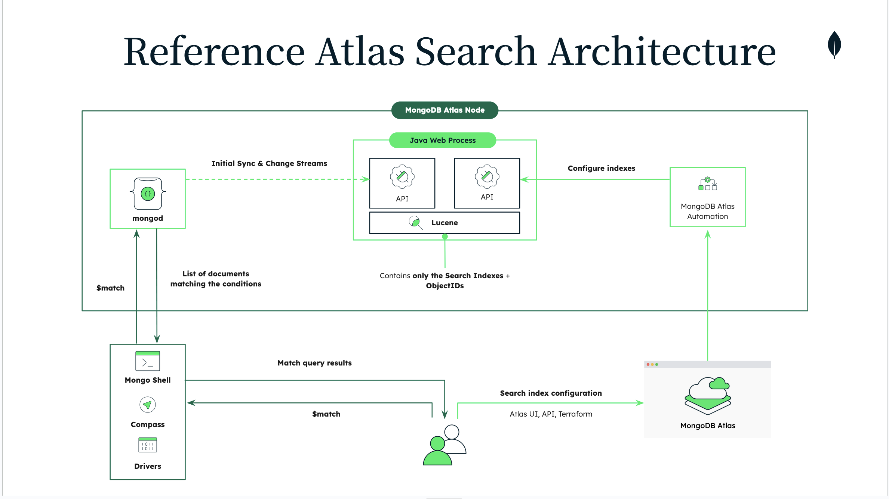

# Unlocking YouTube: Search and Analyze YouTube Videos  


   
Have you ever wished you could quickly search through the content of your favorite YouTube channels, playlists, or even a collection of videos on a particular topic? Perhaps you're trying to find that one video where a speaker mentions a specific concept, or you want to analyze themes across multiple videos. The good news is that it's possible to make YouTube videos as searchable as text documents!  
   
In this blog post, we'll explore a beginner-friendly method to extract transcripts from YouTube videos, store them in a searchable database, and query them to find exactly what you're looking for—all without getting bogged down in technical jargon. Plus, we'll delve into how to process large numbers of videos efficiently using parallelization.  
   
---  
   
## Why Make YouTube Videos Searchable?  
   
YouTube is a vast repository of information, but finding specific content within videos can be challenging. By converting video transcripts into searchable text, you can:  
   
- **Quickly find topics or keywords mentioned in videos.**  
- **Analyze trends or recurring themes across multiple videos.**  
- **Save time by reading transcripts instead of watching entire videos.**  
   
---  
   
## The Magic Behind the Scenes  
   
Our goal is to create a system that:  
   
1. **Collects videos based on a specific criterion** (like a channel ID, search term, or playlist ID).  
2. **Checks if those videos have transcripts available.**  
3. **Extracts and processes the transcripts.**  
4. **Stores the transcripts in a way that makes them easy to search and analyze.**  
5. **Allows you to query the transcripts to find relevant information.**  
   
Let's break down each of these steps in simple terms.  
   
### 1. Collecting Videos  
   
First, we decide *what* videos we want to work with. This could be:  
   
- **All videos from a particular YouTube channel.**  
- **Videos resulting from a specific search query.**  
- **Videos in a particular playlist.**  
   
We use a tool that communicates with YouTube to fetch a list of videos based on our chosen criterion.  
   
### 2. Checking for Transcripts  
   
Not all YouTube videos have transcripts available, and some may have transcripts in languages we don't understand. We need to check if each video has a transcript we can use.  
   
### 3. Extracting and Processing Transcripts  
   
For videos with available transcripts, we:  
   
- **Extract the transcript text.**  
- **Break down the transcripts into manageable chunks.**  
  - This helps in processing and storing the data efficiently.  
- **Add useful information to each chunk, like the video ID and a timestamp.**  
   
### 4. Storing Transcripts for Easy Search  
   
We store the processed transcript chunks in a special database that allows for:  
   
- **Efficient searching and retrieval based on content similarity.**  
- **Filtering based on criteria (like only searching within a specific channel or topic).**  
   
This storage method uses advanced techniques to understand the context and meaning of the text, not just exact keyword matches.  
   
#### Why MongoDB?  



To achieve efficient storage and retrieval, we use **MongoDB**, a flexible, document-oriented database. MongoDB allows us to store transcripts and metadata in a way that is both scalable and efficient for search operations.  
   
**Why choose MongoDB for this task?**  
   
- **Flexible Schema**: Stores data in flexible, JSON-like documents, accommodating varying data structures without the constraints of a rigid schema.  
- **Scalability**: Scales horizontally via sharding, distributing data across multiple servers. This allows us to handle large volumes of data.  
- **Powerful Querying**: Offers robust querying capabilities, including complex queries, aggregations, text search, and support for vector-based similarity search, which is essential for our context-based transcript retrieval.  
- **Indexing Capabilities**: Provides efficient indexing options to optimize query performance.  
- **Support for Vector Search**: Advanced capabilities for handling vector embeddings and similarity searches.  
- **Rich Ecosystem**: Strong community support and extensive documentation.  
   
#### Advantages of Using MongoDB  
   
- **High Performance**: Designed for high-throughput and low-latency data access.  
- **Flexibility**: Easily accommodates changes in the data model without downtime.  
- **Rich Query Capabilities**: Supports complex queries and aggregations, enhancing the search experience.  
- **Community and Support**: Strong ecosystem with extensive documentation and community backing.  
   
#### Visualizing Data Flow with MongoDB  
   
1. **Data Ingestion**: Processed transcript chunks are ingested into MongoDB.  
2. **Indexing**: Text and vector indexes are created for efficient querying.  
3. **Search and Retrieval**: Users perform searches using keywords or semantic queries.  
4. **Result Delivery**: Relevant transcript chunks are retrieved and presented to the user.  
   
#### Best Practices  
   
- **Index Optimization**: Regularly monitor and optimize indexes for query patterns.  
- **Capacity Planning**: Anticipate storage and performance needs as the dataset grows.  
- **Security Measures**: Implement authentication, encryption, and access controls.  
- **Backup and Recovery**: Set up automated backups and have a recovery plan.  
- **Monitoring and Logging**: Use MongoDB's tools to monitor performance and diagnose issues.  
   
#### Potential Challenges and Solutions  
   
- **Large Dataset Management**:  
  - **Challenge**: Handling large volumes of data can strain resources.  
  - **Solution**: Use sharding to distribute data and load across multiple servers.  
   
- **Embedding Storage Size**:  
  - **Challenge**: High-dimensional embeddings can consume significant storage.  
  - **Solution**: Compress embeddings or use dimensionality reduction techniques.  
   
- **Query Performance**:  
  - **Challenge**: Complex queries may become slow as data volume increases.  
  - **Solution**: Optimize queries, use appropriate indexes, and consider denormalization where appropriate.  
   
#### Enhancing Search with Additional Features  
   
- **Synonyms and Stemming**: Improve text search relevance by accounting for synonyms and word variations.  
- **Faceted Search**: Allow users to filter results based on metadata facets like date, channel, or topic.  
- **Cache Frequent Queries**: Implement caching for commonly executed queries to reduce load.  
   
#### Scaling and Future Expansion  
   
As user demand and data volume grow, our MongoDB-based system can scale accordingly.  
   
- **Horizontal Scaling**: Add more nodes to the cluster to handle increased load.  
- **Geo-Distributed Clusters**: Deploy clusters across multiple regions for global performance and redundancy.  
- **Microservices Architecture**: Break down the application into microservices interacting with MongoDB for better maintainability.  
   
By leveraging MongoDB's robust features and flexibility, we ensure that our transcript database is efficient, scalable, and ready for future enhancements.  
   
---  
   
## Handling Large Volumes of Videos Efficiently  
   
When working with a large number of videos, processing each one sequentially can be time-consuming. That's where **parallelization** comes into play.  
   
### Understanding `VIDEO_LIMIT`  
   
In our system, we introduce a `VIDEO_LIMIT` parameter. This parameter controls the maximum number of videos to process at a time. By setting a reasonable limit, we can manage resource usage and processing time effectively.  
   
```python  
VIDEO_LIMIT = 50  # Adjust this number based on your system's capacity  
```  
   
**Why Use `VIDEO_LIMIT`?**  
   
- **Resource Management**: Prevents overloading your system by processing too many videos simultaneously.  
- **Time Efficiency**: Allows you to process a manageable batch of videos quickly.  
- **Flexibility**: Gives you control over how much data you're working with at any given time.  
   
### Demystifying Parallelization in Transcript Processing  
   
**What Is Parallelization?**  
   
Parallelization involves dividing a task into smaller sub-tasks that can be executed simultaneously across multiple processors or cores. This approach significantly reduces the total processing time.  
   
**Introducing Ray for Parallel Processing**  
   
[Ray](https://www.ray.io/) is an open-source library that simplifies parallel and distributed computing in Python. It allows you to run multiple tasks in parallel without the need for complex threading or multiprocessing code.  
   
**How Parallelization Works in Our System**  
   
1. **Initialize Ray**  
  
   We start by importing the Ray library and initializing it. This sets up the necessary processes for parallel execution.  
  
   ```python  
   import ray  
   ray.init()
   ....
   # Limit to VIDEO_LIMIT videos      
   videos_to_process = transcript_available_videos[:VIDEO_LIMIT]    
   ```  
   
2. **Define Remote Functions**  
  
   We use Ray's `@ray.remote` decorator to define functions we want to run in parallel. This decorator signals that the function can be executed remotely (on another core or machine).  
  
   ```python  
   @ray.remote  
   def process_single_video_transcript(video_id, CONFIG):  
       # Extract and process the transcript  
       # Store data in the database  
   ```  
   
3. **Launch Multiple Tasks in Parallel**  
  
   Instead of processing each video one after the other, we create a list of tasks that Ray can execute simultaneously.  
  
   ```python  
   tasks = []  
   for video_id in videos_to_process:  
       task = process_single_video_transcript.remote(video_id, CONFIG)  
       tasks.append(task)  
   ```  
   
4. **Gather Results**  
  
   After dispatching all tasks, we collect the results once they're completed. Ray efficiently manages the execution and resource allocation behind the scenes.  
  
   ```python  
   ray.get(tasks)  
   ```  
   
5. **Continue with Processing**  
  
   Once all tasks are completed, we proceed with any additional processing or querying.  
   
**Advantages of Using Ray**  
   
- **Efficiency**: Utilizes all available CPU cores to reduce total processing time.  
- **Simplicity**: Provides an easy-to-use API that integrates seamlessly with Python.  
- **Scalability**: Can scale computations to multiple machines if needed.  
   
**Tips for Effective Parallelization**  
   
- **Monitor Resource Usage**: Be mindful of your system's CPU and memory capacity.  
- **Avoid Shared State**: Ensure that remote functions do not modify shared variables to prevent conflicts.  
- **Handle Exceptions**: Implement error handling within your remote functions to catch and log exceptions.  
   
---  
   
## Putting It All Together: An Example  
   
Imagine we're interested in learning about Python programming tutorials from a popular YouTube channel. Here's how we'd use our system:  
   
1. **Set the Criterion:**  
  
   - We specify that we want videos from the channel with the ID `"UCCezIgC97PvUuR4_gbFUs5g"` (a well-known Python tutorial channel).  
  
   ```python  
   CONFIG = {  
       "TYPE": "CHANNEL",  
       "ID": "UCCezIgC97PvUuR4_gbFUs5g"  
   }  
   ```  
   
2. **Fetch Videos:**  
  
   - The system retrieves a list of videos from that channel.  
   - Let's say it finds 100 videos.  
  
   ```python  
   videos = get_videos(CONFIG)  
   ```  
   
3. **Filter Videos with Transcripts:**  
  
   - The system checks which of these videos have transcripts.  
   - Suppose 80 videos have transcripts available in English.  
  
   ```python  
   transcript_available_videos = filter_videos_with_transcripts(videos, VIDEO_LIMIT)  
   ```  
   
4. **Limit the Number of Videos:**  
  
   - We use `VIDEO_LIMIT` to process a manageable number of videos.  
  
   ```python  
   videos_to_process = transcript_available_videos[:VIDEO_LIMIT]  
   ```  
   
5. **Process Transcripts in Parallel:**  
  
   - Using Ray, we process the transcripts of these videos simultaneously.  
  
   ```python  
   tasks = []  
   for video_id in videos_to_process:  
       task = process_single_video_transcript.remote(video_id, CONFIG)  
       tasks.append(task)  
     
   ray.get(tasks)  
   ```  
   
6. **Store Transcripts:**  
  
   - The processed chunks are stored in our searchable database (MongoDB Atlas).  
   - This database understands the context of the text, not just the words.  
   
7. **Search Transcripts:**  
  
   - You input a query, like `"How to use dictionaries in Python?"`  
   - The system searches through the stored transcripts.  
   - It returns the most relevant sections where dictionaries in Python are discussed.  
  
   ```python  
   query = "How to use dictionaries in Python?"  
   pre_filter = {"config": {"$eq": "CHANNEL:UCCezIgC97PvUuR4_gbFUs5g"}}  
   docs = query_vector_store(embeddings, collection, index_name, query, pre_filter=pre_filter)  
   ```  
   
---  
   
## Benefits of This Approach  
   
- **Time-Saving:** Quickly find specific information without watching entire videos.  
- **Contextual Search:** Get results based on the meaning of your query.  
- **Scalable and Efficient:** Can handle transcripts from hundreds or thousands of videos using parallel processing.  
   
---  
   
## Getting Started Yourself  
   
### Exploring the Code  
   
Let's dive into how the code accomplishes this task.  
   
#### Initialization  
   
Start by importing necessary libraries and initializing Ray for parallel processing:  
   
```python  
import os  
import ray  
from dotenv import load_dotenv  
   
load_dotenv()  
ray.init()  
```  
   
#### Configuration  
   
Define a configuration to specify whether you're fetching videos from a channel, search query, or playlist:  
   
```python  
CONFIG = {  
    "TYPE": "CHANNEL",  
    "ID": "UCCezIgC97PvUuR4_gbFUs5g"  # Replace with your desired channel ID  
}  
```  
   
#### Fetching Videos  
   
Fetch videos based on the configuration using `scrapetube`:  
   
```python  
def get_videos(config):  
    if config["TYPE"] == "CHANNEL":  
        return list(scrapetube.get_channel(config["ID"]))  
    elif config["TYPE"] == "SEARCH":  
        return list(scrapetube.get_search(config["ID"]))  
    elif config["TYPE"] == "PLAYLIST":  
        return list(scrapetube.get_playlist(config["ID"]))  
    else:  
        raise ValueError("Invalid CONFIG TYPE")  
   
videos = get_videos(CONFIG)  
```  
   
#### Checking for Transcripts  
   
Filter videos that have transcripts available:  
   
```python  
def check_transcript_availability(video_id):  
    try:  
        YouTubeTranscriptApi.list_transcripts(video_id)  
        return True  
    except:  
        return False  
   
def filter_videos_with_transcripts(videos, video_limit):  
    return [  
        video["videoId"]  
        for video in videos[:video_limit]  
        if check_transcript_availability(video["videoId"])  
    ]  
   
VIDEO_LIMIT = 50  # Adjust based on your needs  
transcript_available_videos = filter_videos_with_transcripts(videos, VIDEO_LIMIT)  
```  
   
#### Processing Videos with Ray  
   
Process video transcripts in parallel using Ray:  
   
```python  
@ray.remote  
def process_single_video_transcript(video_id, CONFIG):  
    # Load and process the transcript  
    # Store data in MongoDB Atlas  
    pass  # Implementation details go here  
   
tasks = []  
for video_id in transcript_available_videos:  
    task = process_single_video_transcript.remote(video_id, CONFIG)  
    tasks.append(task)  
   
# Wait for all tasks to complete  
ray.get(tasks)  
```  
   
**Note:** The actual implementation inside `process_single_video_transcript` involves extracting the transcript, splitting it into chunks, adding metadata, creating embeddings, and storing it in MongoDB Atlas.  
   
#### Embedding and Storing in MongoDB Atlas  
   
After processing the transcripts, store them with their embeddings in MongoDB Atlas:  
   
```python  
def ensure_search_index(collection, index_name):  
    # Ensure the search index exists  
    pass  # Implementation details go here  
   
def process_single_video_transcript(video_id, CONFIG):  
    # ... (transcript extraction and processing)  
    # Create embeddings  
    embeddings = OllamaEmbeddings(model="nomic-embed-text")  
    # Store in MongoDB Atlas  
    vector_store = MongoDBAtlasVectorSearch.from_documents(  
        docs,  
        embeddings,  
        collection=collection,  
        index_name=index_name  
    )  
    ensure_search_index(collection, index_name)  
```  
   
#### Querying the Vector Store  
   
Now that our transcripts are stored with their embeddings, we can perform searches to find relevant content:  
   
```python  
def query_vector_store(embeddings, collection, index_name, query, pre_filter=None):  
    vector_store = MongoDBAtlasVectorSearch(  
        embedding=embeddings,  
        collection=collection,  
        index_name=index_name  
    )  
    if pre_filter:  
        docs = vector_store.similarity_search(query=query, pre_filter=pre_filter)  
    else:  
        docs = vector_store.similarity_search(query)  
    return docs  
   
# Example query  
query = "How to use dictionaries in Python?"  
pre_filter = {"config": {"$eq": "CHANNEL:UCCezIgC97PvUuR4_gbFUs5g"}}  
docs = query_vector_store(embeddings, collection, index_name, query, pre_filter=pre_filter)  
```  
   
---  
   
## Conclusion  
   
By making YouTube video transcripts searchable, we're unlocking a new way to access and analyze video content. Whether you're a student, researcher, or just a curious learner, this approach can help you delve into topics more efficiently and discover insights that might be hidden within hours of video content.  
   
Remember, the power of technology lies in making information accessible and useful—and sometimes, all it takes is looking at things from a different angle!  
   
---  
   
## Next Steps: Try It Yourself!  
   
Ready to get started? Here's what you can do:  
   
- **Explore the Code:** Dive into the full codebase to understand how each component works.  
- **Customize for Your Needs:** Adjust the `CONFIG` and `VIDEO_LIMIT` to target the videos you're interested in.  
- **Experiment with Queries:** Use different search queries to see what insights you can uncover.  
- **Scale Up:** As you become more comfortable, consider increasing the `VIDEO_LIMIT` or expanding to multiple channels or topics.  
   
---  
   
*Happy searching and discovering! If you have any questions or need guidance on getting started, feel free to reach out in the comments below.*  
   
---  
